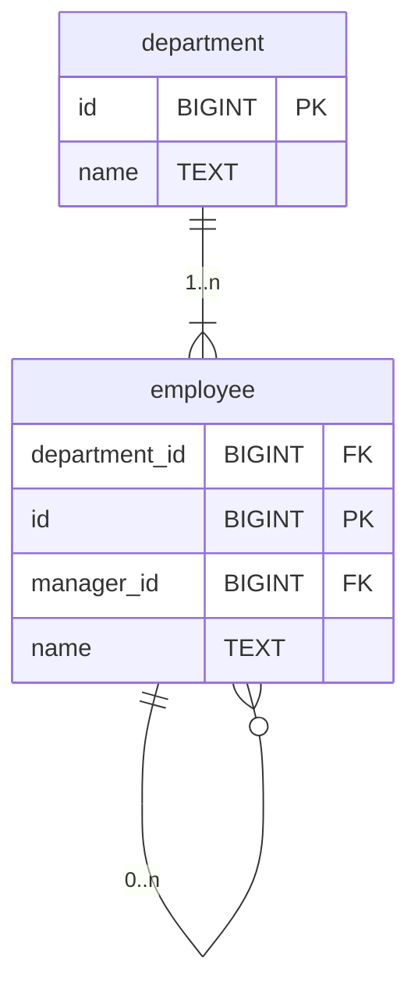

# Mermaid Entity-Relationship Diagram Writing Skill

Given one or more SQL `CREATE TABLE` statements, produce a Mermaid `erDiagram` block.

## Output format

Produce a Mermaid erDiagram:

```mermaid
erDiagram
  ...
```

Your response must consist of the Mermaid diagram itself, exactly as specified above -- not a description of the
diagram, not the entities/relationships listed in prose, and never strip any details. If you are asked to explain or
summarize the diagram in addition, include the digram in full regardless -- never substitute prose for it.

## Step-by-step instructions

### 1. Parse tables

For each `CREATE TABLE` statement extract:

* Table name.
* Each column: name and type (strip length/precision, e.g. `VARCHAR(255)` -> `VARCHAR`, `TIMESTAMP(6)` -> `TIMESTAMP`).
* Normalize known type names to uppercase regardless of how they appear in the source DDL (e.g. `bigint` or `BigInt` ->
  `BIGINT`, `varchar` -> `VARCHAR`, `text` -> `TEXT`).
* Foreign key constraints (inline or table-level), noting the referencing column and the referenced table.
* Primary key and unique constraints.
* Ignore: `NOT NULL`, `DEFAULT`, `CHECK`, `GENERATED ALWAYS AS`, `ON DELETE`, constraint names, and all other
  modifiers -- columns carry name, type, and simple foreign key, primary key, or unique constraints only.

### 2. Sort

* List tables in **alphabetical order**
* List columns within each table in **alphabetical order**

### 3. Declare entities

```
entity_name {
  column_name type key
  ...
}
```

`key` is optional and marks constraints on that column, using Mermaid's key tokens:

| Constraint on column                               | Key token |
|----------------------------------------------------|-----------|
| Column is part of the `PRIMARY KEY`                | `PK`      |
| Column is a foreign key (references another table) | `FK`      |
| Column has a `UNIQUE` constraint                   | `UK`      |

* Omit the key token entirely for columns with none of these constraints.
* If a column has more than one applicable constraint (e.g. a composite key column that is both part of the primary key
  and a foreign key), separate tokens with a comma: `PK, FK`.
* Alphabetical sort order (step 2) is by column name and is unaffected by whether a key token is present.
* Do not add quoted `"comment"` annotations unless the user explicitly asks for column descriptions -- this skill only
  adds PK/FK/UK markers.

### 4. Declare relationships

For every foreign key found, emit one relationship line using Mermaid's **long-form string syntax** (not crow's-foot
ASCII):

```
TableA <left-cardinality> to <right-cardinality> TableB : "label"
```

**Valid long-form cardinality tokens:**

* `only one`
* `zero or one`
* `one or more`
* `zero or more`

**Relationship string rules:**

| Side                                        | Situation                                      | Token          |
|---------------------------------------------|------------------------------------------------|----------------|
| Parent (referenced table)                   | Always exactly one matching row                | `only one`     |
| Child (referencing table), FK is `NOT NULL` | Must reference a parent, many children allowed | `one or more`  |
| Child (referencing table), FK is nullable   | May or may not reference a parent              | `zero or more` |

So the two common patterns are:

```
referenced_table only one to one or more referencing_table : "1..n"
referenced_table only one to zero or more referencing_table : "0..n"
```

Use `zero or more` when the FK column is nullable; use `one or more` when it is `NOT NULL`.

**Label format:** Use `"1..n"` or `"0..n"` (not a verb phrase) to convey multiplicity at a glance.

### 5. Omit unresolvable references

If a FK references a table not present in the provided DDL, skip that relationship line entirely (do not invent a stub
entity).

## Example

Input:
```sql
CREATE TABLE department (
  id   BIGINT NOT NULL PRIMARY KEY,
  name TEXT   NOT NULL
);

CREATE TABLE employee (
  id            BIGINT NOT NULL PRIMARY KEY,
  department_id BIGINT NOT NULL REFERENCES department,
  manager_id    BIGINT REFERENCES employee,
  name          TEXT   NOT NULL
);
```

Output:


Explanation:
* `id` is part of `PRIMARY KEY` in both tables -> `PK`.
* `department_id` is a foreign key referencing `department` -> `FK`; it's also `NOT NULL` -> `one or more` on the
  relationship.
* `manager_id` is a foreign key referencing `employee` -> `FK`; it's nullable -> `zero or more` on the relationship.
* Self-referential foreign key is valid -- emit the relationship with the same table on both sides.
