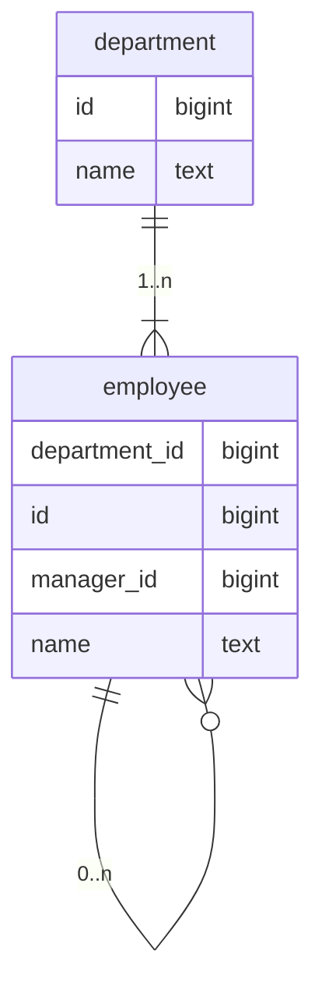

# Mermaid Entity-Relationship Diagram Writing Skill

Given one or more SQL `CREATE TABLE` statements, produce a Mermaid `erDiagram` block.

## Output format

Produce a fenced code block:

````
```mermaid
erDiagram
  ...
```
````

## Step-by-step instructions

### 1. Parse tables

For each `CREATE TABLE` statement extract:
- Table name
- Each column: name and type (strip length/precision, e.g. `VARCHAR(255)` → `varchar`, `TIMESTAMP(6)` → `timestamp`)
- Foreign key constraints (inline or table-level), noting the referencing column and the referenced table

Ignore: `PRIMARY KEY`, `NOT NULL`, `DEFAULT`, `CHECK`, `UNIQUE`, `GENERATED ALWAYS AS`, `ON DELETE`, constraint names,
and all other modifiers — columns carry name + type only.

### 2. Sort

- List tables in **alphabetical order**
- List columns within each table in **alphabetical order**

### 3. Declare entities

```
entity_name {
  column_name type
  ...
}
```

One entity block per table. No PKs, FKs, or other markers inside the block.

### 4. Declare relationships

For every foreign key found, emit one relationship line using Mermaid's **long-form string syntax** (not crow's-foot
ASCII):

```
TableA <left-cardinality> to <right-cardinality> TableB : "label"
```

**Valid long-form cardinality tokens:**
- `only one`
- `zero or one`
- `one or more`
- `zero or more`

**Relationship string rules:**

| Side                                        | Situation                                      | Token          |
|---------------------------------------------|------------------------------------------------|----------------|
| Parent (referenced table)                   | Always exactly one matching row                | `only one`     |
| Child (referencing table), FK is `NOT NULL` | Must reference a parent, many children allowed | `one or more`  |
| Child (referencing table), FK is nullable   | May or may not reference a parent              | `zero or more` |

So the two common patterns are:

```
referenced_table only one to one or more referencing_table : "1..n"
referenced_table only one to zero or more referencing_table : "0..n"
```

Use `zero or more` when the FK column is nullable; use `one or more` when it is `NOT NULL`.

**Label format:** Use `"1..n"` or `"0..n"` (not a verb phrase) to convey multiplicity at a glance.

### 5. Omit unresolvable references

If a FK references a table not present in the provided DDL, skip that relationship line entirely (do not invent a stub
entity).

## Example

Input:
```sql
CREATE TABLE department (
  id   BIGINT NOT NULL PRIMARY KEY,
  name TEXT   NOT NULL
);

CREATE TABLE employee (
  id            BIGINT NOT NULL PRIMARY KEY,
  department_id BIGINT NOT NULL REFERENCES department,
  manager_id    BIGINT REFERENCES employee,
  name          TEXT   NOT NULL
);
```

Output:
````

````

Explanation:
- `department_id` is `NOT NULL` → `one or more`
- `manager_id` is nullable → `zero or more`
- Self-referential FK is valid — emit the relationship with the same table on both sides
